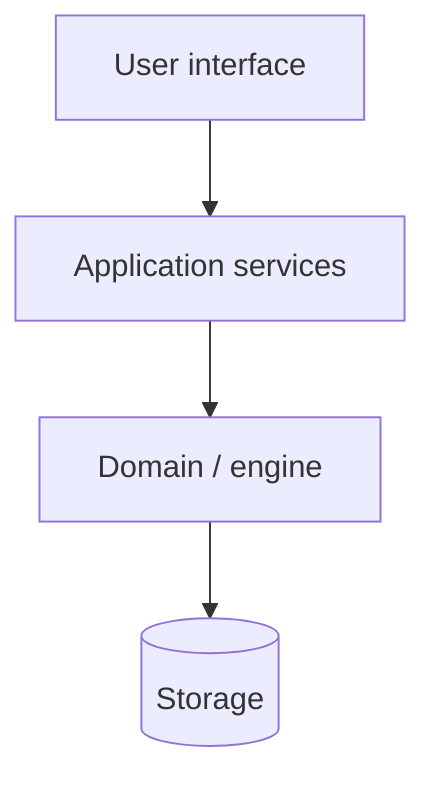

# Architecture

<!-- One paragraph: what this is, and who uses it through what. -->

## The layers

<!-- Top down, the thing a user touches at the top. Dotted arrows for the exceptions, labelled. -->

## What lives where

| Package | Holds | Rule of thumb |
|---|---|---|
| | | |

## The dependency rule

<!-- Measure it, don't assume it. Then state the rules, and name any place the code breaks them.
     A known gap with a backlog entry is honest; a rule everyone quietly ignores is not. -->

1. **Nothing points upward.**
2. **No interface imports another.**

## How <the main flow> works

<!-- The one sequence someone must understand to be useful here. -->

## Invariants

<!-- The general rules. Anything binding only one area lives in that directory's AGENTS.md. -->

1.
2.
