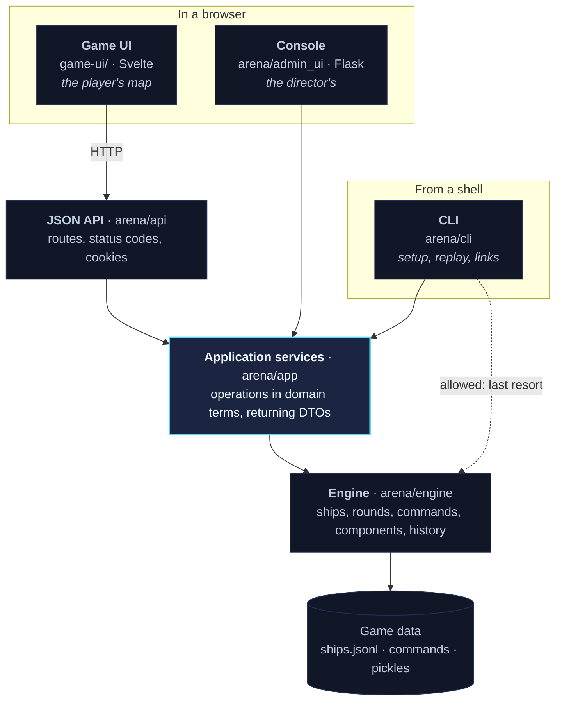
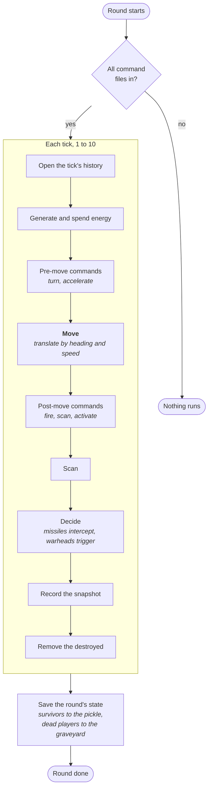

# Architecture

Starship Arena is a recreation of a 1991 play-by-mail game. Players command starships; a round is
ten ticks of simulation, run when everyone's orders are in. One engine is played through three
interfaces: an interactive map for players, a console for the director, and a command line.

## The layers



Everything crosses one line: **`arena/app` is the seam**. Above it nobody holds an engine object or
a file path, so storage can change without an interface noticing.

The dotted arrow is deliberate. The CLI is for someone with a shell on the host, and it is where
you go when the seam itself is what is broken.

## What lives where

| Package | Holds | Rule of thumb |
|---|---|---|
| `arena/engine` | Ships, rounds, commands, components, history | The game's rules. Knows nothing about interfaces or the web |
| `arena/engine/objects` | Objects in space, built from components | A new kind of thing goes here |
| `arena/engine/objects/registry` | Ship and machine types | Data, expressed as Python |
| `arena/app` | `GameService`, `AdminService`, DTOs, the player registry | Operations an interface needs, in domain terms |
| `arena/api` | HTTP shape: routes, status codes, cookies | Translation only, no game logic |
| `arena/admin_ui` | The director's Flask pages and its own facade | One UI's semantics |
| `arena/cli` | Setting up, generating rounds, issuing links | The tool for a shell on the host |
| `game-ui/` | The player's map, planning, log | Svelte 5 + Vite, no framework beyond that |

The **services layer is the seam**. It speaks in domain terms and returns DTOs, plain dataclasses
with no framework in them, so that what is above it never handles an engine object and never
learns where the data is kept. Storage is files on disk today; the seam is what allows that to
change without touching an interface.

Each interface has **its own facade** on top of that seam, not a shared one: `AppFacade` speaks the
console's language, and the API's routers speak HTTP. A shared facade would have to serve both and
would end up as the union of two vocabularies.

## The dependency rule

Measured from the imports, today:

```
admin_ui -> app      2
admin_ui -> engine   5
api      -> app      4
app      -> engine   8
cli      -> app      1
cli      -> engine   4
```

The rules:

1. **Nothing points upward.** The engine imports nothing from `app`, `api`, `admin_ui` or `cli`.
2. **No interface imports another.** The console does not import from the API, and neither
   imports from the game UI.
3. **The console goes through the admin service, never the engine.** It is a user interface like
   any other, and the seam only means anything if the interfaces respect it.
4. **The CLI may reach the engine.** It is the tool of last resort, run from a shell on the host,
   and it is where you go when the seam itself is what is broken.

`admin_ui -> engine` is five imports that rule 3 says should not exist. A known gap, on the
backlog. The API is already clean.

## Processing a round

**The game is deterministic by design.** A round is a pure function of the previous round's saved
state plus the command files. Same inputs, same game, every time.

Nothing in round processing reads a clock or draws a random number. Setup does draw, to place
factions, and it writes the coordinates back into `ships.jsonl` so that placement replays too.

That determinism carries weight. Regenerate depends on it, and so does throwing stale saved state
away instead of migrating it.

A round runs only when every player ship has a command file. Then ten ticks, each running every
object through the same phases in the same order:



`GameRound.do_tick` holds that order, and it is the heart of the engine. Changing it changes the
game.

Each tick every object records a **snapshot** into its history: position, heading, speed, hull,
battery and what every component reports. The values themselves, never the objects holding them:
the history records what was true at that tick, and a shared object would record how the round
ended, ten times over.

## Serving a request

In production one WSGI application serves everything (`arena/serve.py`):

- `/api/...` → the FastAPI app, run inside WSGI through `a2wsgi`
- `/play/...` → the built game UI, static files from `game-ui/dist`, no Node at runtime
- everything else → the Flask console

One origin, so the UI's relative `/api/...` calls need no configuration and there is no CORS.

In development the three run separately (`arena-dev.sh`) for hot reloading, and Vite proxies
`/api` to the API so the browser still sees one origin.

## Invariants

Rules a change should not break.

1. The order objects are processed in must never change the outcome of a tick.
2. Nothing in `arena/engine` imports anything above it.
3. Nothing above the services layer handles an engine object or a file path.
4. No interface imports another interface.
5. Every path is anchored to the repository, never to the working directory.
6. Nothing creates a thread, event loop or pool at import time. The host preforks.
7. Snapshots hold values, never references.
8. An object says what it is through its own properties, not through class attributes or
   inspection of its class hierarchy.
9. Stale game data is regenerated, never read through a compatibility shim.
10. Round processing stays deterministic: no clock, no random numbers.

These are the general rules. Rules that only bind one part of the codebase live in that
directory's `CLAUDE.md`, close to the code they govern.

Rule 1 is currently broken: weapons fire post-move, so whether a freshly launched missile is in
space when something explodes depends on iteration order. On the backlog.
