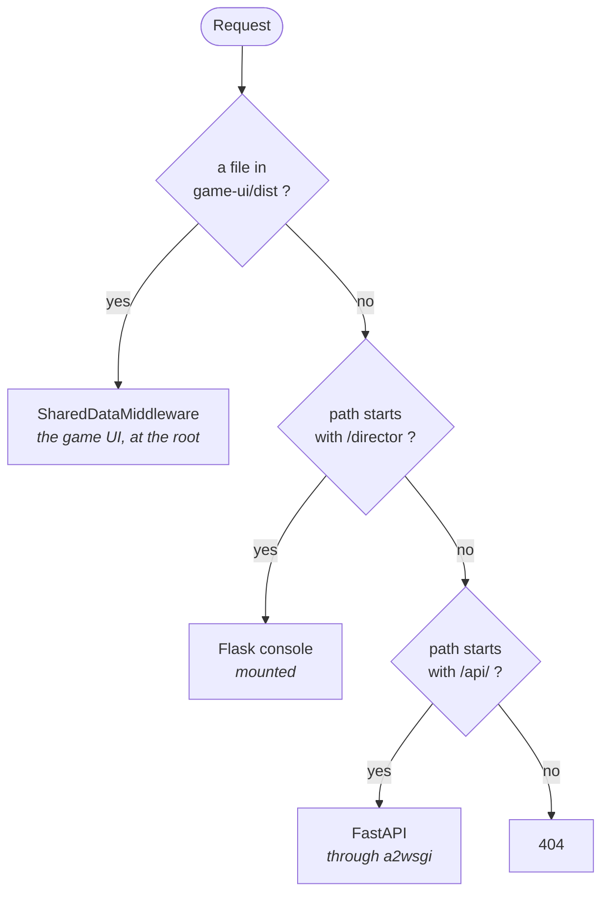
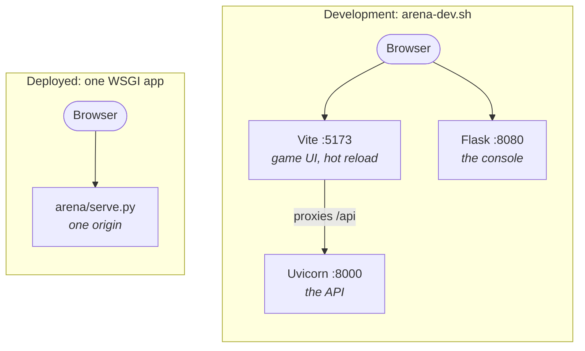

# Deployment

Starship Arena runs on PythonAnywhere as a single WSGI application. Nothing on the host's
dashboard needs configuring, because every default in `arena/cfg.py` is the deployed one and
every path is anchored to the repository rather than the working directory.

Deploying is `git pull` and a reload, and `./arena-deploy.sh` does both from your own machine:
the pull over ssh, the reload through the host's API. Neither half wants a browser, so a deploy
never leaves the terminal.

**A pull that changes what a saved world holds needs `./arena-regenerate.sh` on the host after it.**
The pickles are read as they stand and nothing tolerates an older shape, so new code meeting old
saved state raises on the first request that reaches it. Login is such a request: it returns the
games you have ships in, which reads every game's roster out of the world. The console still lets a
director in, because its gate reads `players.jsonl` and stops there, which is what a game UI stuck
on its login page and a working console together mean.

## One application, three jobs

`arena/serve.py` is a switchboard:



The game is the site: it answers at the root. The console lives under `/director` and the API
under `/api`.

Development runs the same three parts as separate servers, which is what gives hot reloading:



The browser sees one origin either way, because Vite proxies `/api`. Cookies ignore ports, so
signing in on 5173 also signs you in on 8080.

Three details in that file exist for reasons that aren't obvious from the code:

**The API is matched, not mounted.** Its routes already carry their own `/api` prefix. Mounting it
under one would strip the prefix and leave every route unreachable.

**The console is mounted, not matched.** Mounting sets `SCRIPT_NAME`, and that is what makes Flask
write `/director` in front of every URL it builds. No route in the console names its own prefix,
so moving it stays one line here.

**The root is rewritten to `/index.html`.** Static file serving has no notion of a directory
index, so the page has to be named. Vite builds with `base: './'`, which keeps the asset links
relative and the bundle servable from wherever it is put.

## The host preforks, with threads disabled

uWSGI loads the application in a master process and forks the workers. A fork keeps only the
thread that called it.

So anything holding a thread, an event loop or a connection pool must be built on first use inside
the worker, never at import. `a2wsgi` starts an event loop thread the moment its adapter is
constructed, which is why `arena/serve.py` builds that adapter lazily.

Get this wrong and every route times out at `504-loadbalancer` after 300 seconds, with
`HARAKIRI ON WORKER` in the server log. The application imports fine, which makes it look like a
routing problem.

The server log also says `*** Python threads support is disabled ***`. On Python 3.10 the GIL is
always initialised, so threads created inside a worker do run.

## No Node at runtime

`game-ui/dist` is committed, because the host has no build step. Rebuild it whenever the UI
changes:

```
npm run build --prefix game-ui
```

The bundle filename carries a content hash, so a deploy is a delete plus an add in git. That hash
is what makes a browser fetch the new code instead of serving the old from cache.

`index.html` is served with the same 12-hour cache as everything else, so a returning player can
keep an old page for a while after a deploy. Telling people to refresh is the current answer.

## No uv on the host, so dependencies are a text file

The host has a plain virtualenv at `~/.virtualenvs/starship-arena` running Python 3.10, which is
why `requires-python` is `>=3.10` while development is on the latest. `arena-sync.sh` installs
into whichever of the two it finds itself on:

```bash
./arena-sync.sh          # uv sync where there is uv, pip -r requirements.txt where there is not
```

`arena-deploy.sh` runs it on the host between the pull and the reload, so adding a dependency is
one edit and a deploy. Nothing already installed is touched, and a release that needs a new
package cannot reload into an `ImportError`.

The dependency list therefore exists twice: `[project].dependencies` in `pyproject.toml`, where it
is decided, and `requirements.txt`, which is the copy the host can read. Two files because 3.10 has
no `tomllib` and pip cannot install a project that is not built as a package.
`test/docs/test_dependencies.py` fails when they disagree, so the copy cannot go stale unnoticed.

They hold specifiers rather than pinned versions, because each machine resolves for its own Python.
`uv.lock` is resolved for the development interpreter, so exporting it here would pin versions the
host cannot install.

## Per-host settings

`secret.py` is gitignored, so each machine has its own. Everything here is read from the
environment first and from `secret.py` second:

```python
GAME_DATA_DIR = 'game-data'                                    # relative means inside the repo
SITE_URL = 'https://starship-arena-agfx.pythonanywhere.com'    # the address players use
LOG_DIR = 'logs'                                               # optional; relative, same rule
DISCORD_MESSAGE_WEBHOOK = 'https://discord.com/api/webhooks/...'  # where announcements go
PA_API_TOKEN = '...'                                           # deploying: the reload call
PA_SSH_KEYFILE = '~/.ssh/id_pa_ssh'                            # deploying: the pull
```

The first four are `arena/cfg.py`. The `PA_` pair is the odd one out: no application code reads
them, only `arena-deploy.sh`, and only on the machine you deploy *from*. The host's own copy of
`secret.py` never needs either.

`DISCORD_MESSAGE_WEBHOOK` is one address for the whole installation. Each game says whether it
announces, in its own settings; left out here, nothing is announced anywhere, which is what a
development machine wants. To prove the host can reach the channel, from a console on it:

```bash
cd ~/starship-arena
~/.virtualenvs/starship-arena/bin/python -m arena.cli.main announce
```

That is the interpreter cron uses. There is no `uv` on the host.
[ADR 0029](adr/0029-announcements-leave-through-channels.md).

`PA_SSH_KEYFILE` is optional, and naming it does one thing — it pins the pull to that key with
`IdentitiesOnly`, so ssh stops offering every other key you own and hitting the server's limit on
attempts before it gets to the right one. A `Host` entry in `~/.ssh/config` settles the same
question; leave the setting out if you have one.

`GAME_DATA_DIR` must never use `os.path.abspath()`. That resolves against the working directory,
which the host picks for itself, and a relative value is already anchored to the repository.

`SITE_URL` is read only where a login link is made whole: the CLI printing one, and the console's
player page. It's the address a link is *for*, not where this machine serves from, so the same
value belongs in both copies.

There is no timezone setting. The server keeps the host's clock, and PythonAnywhere's is UTC, so a
game asking for hour 20 processes at 20:00 UTC. Every screen showing an hour says which clock it
is. [ADR 0027](adr/0027-the-server-keeps-one-timezone.md).

## Processing on the clock

A game names the hours it processes on, and cron is what makes those hours happen. Hourly, on the
hour, with the reminders on the half hour so they reach people in time for it:

```
0  * * * * /home/you/starship-arena/arena-cron.sh
30 * * * * /home/you/starship-arena/arena-cron.sh remind_due
```

The script takes the action and defaults to `process_due`, so one copy of the virtualenv hunt
serves both. The reminder pass keeps to one poke each per round through the game's journal rather
than through the clock, which leaves how often you run it a decision made here and nowhere else.
[ADR 0037](adr/0037-players-are-reminded-before-a-deadline.md).

No redirect. The run logs itself to `logs/arena.log`, and what happens before logging is
configured, a missing virtualenv or a broken import, goes to the host's own capture of the task's
output.

`arena-cron.sh` looks for `~/.virtualenvs/starship-arena` first, then `uv`, then bare `python3`.
Cron runs with `PATH=/usr/bin:/bin` and no profile, so a `uv` in `~/.local/bin` is invisible to it:
on a machine with no virtualenv at that path the fallback reaches `python3` and dies on the
imports.

The web application writes no log file of its own. Two preforked workers would both rename one at
rollover and the loser would go on writing to an unlinked inode, so they print to stderr and the
host's server log keeps it.

## Rolling out logins

The console refuses everyone until a director exists, so the order matters:

1. `git pull`
2. `./arena-link.sh <you> https://your.site --director` in a Bash console on the host
3. Open that link once

Reload before step 2 and the console shows its 403 page until you go back to the shell.

## The site password

The host has HTTP Basic Auth across the whole site. That's a bot moat, not identity: everyone who
plays shares it. Logins are what tell people apart, and they sit on top of it.
